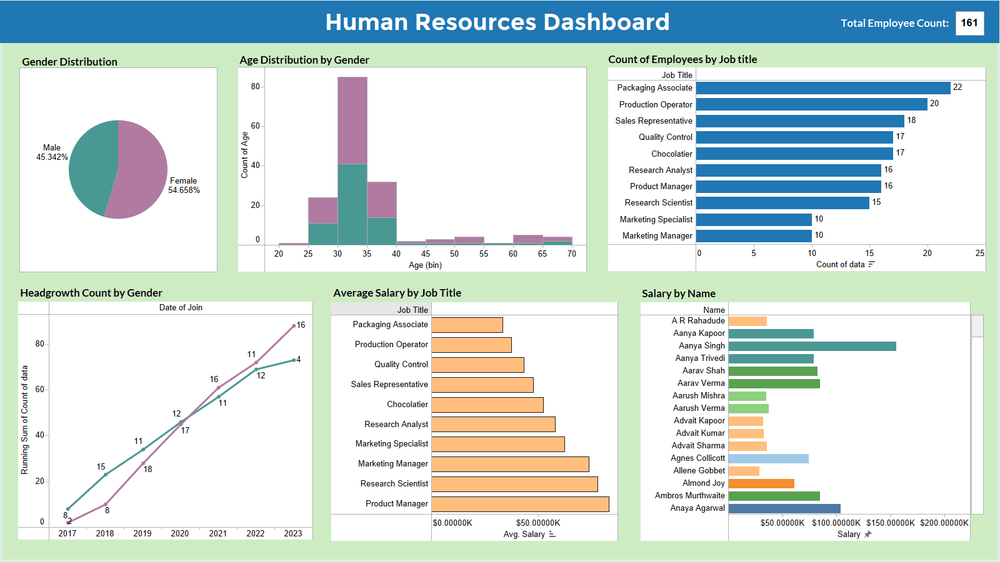

# Human Resources Dashboard 📊

Tableau Public Preview Link 🔗: [HR-dashboard-tableau](https://public.tableau.com/app/profile/subhanu.chamaka/viz/HRDashboard_17062017957680/Dashboard1?publish=yes)

Human Resources Dashboard for a company called 'Awesome Chocalates'. Created using Tableau to provide insights and trends in the organization's workforce. It can be used to inform HR decisions, identify areas for improvement, and track changes over time.

This dashboard provides a comprehensive overview of the organization's human resources data. with graphical interactive plots such as ,
- Gender Distribution
- Age Distribution
- Employee Counts by Job Types
- Headcount Growth Trends
- Average Salaries by Job Titles
- Salary by names
- KPI of total employee count on top

All these visual metrics are interactive and can be filtered through graphically as per the changes in other plots. 

## Insights
**Key Insights from the dashboard were**,
- Gender Breakdown is roughly even 45.34% male and 54.65% female employees
- The employee age distibution shows a concentration in the 25 - 40 ages
- Top 3 job roles with highest employee counts are, Packaging associate, Production Operator and Sales Representative
- There's a strong headcount growth from 2017 - 2023 in both genders
- Highest average salary is earned by product managers

---
Made with ❤️ by [Subhanu](https://github.com/subhanu-dev)
